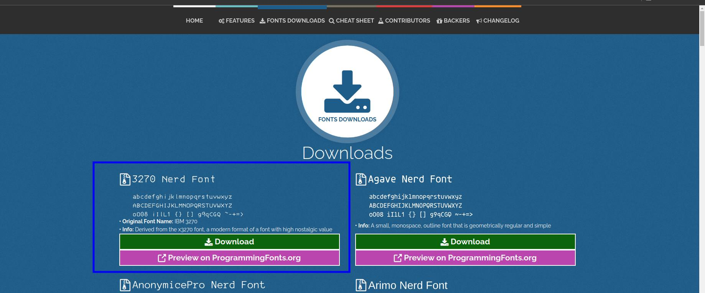
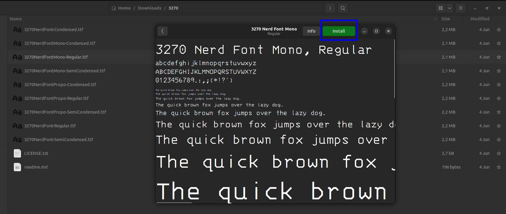
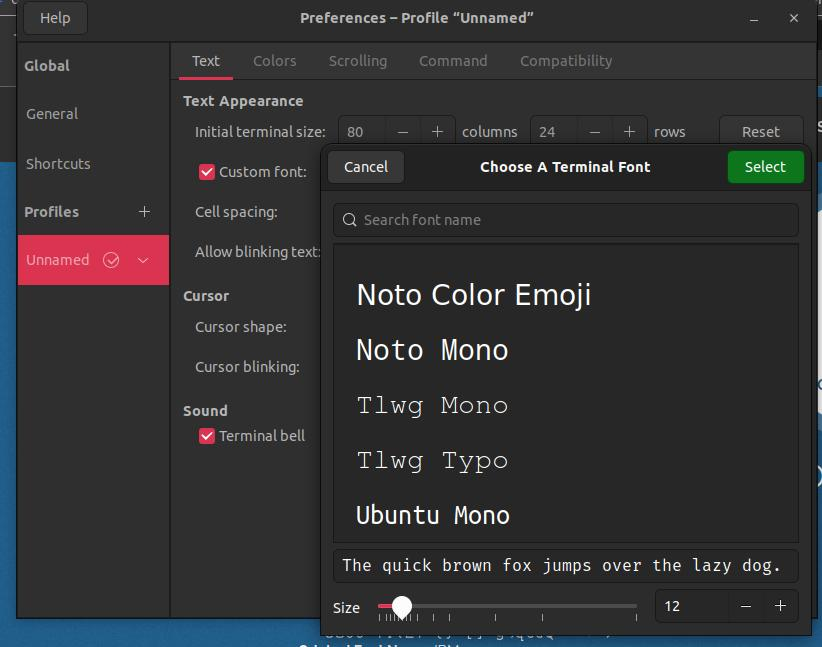

1. Install Oh-my-posh

```
sudo wget https://github.com/JanDeDobbeleer/oh-my-posh/releases/latest/download/posh-linux-amd64 -O /usr/local/bin/oh-my-posh
sudo chmod +x /usr/local/bin/oh-my-posh
```

2. Install Theme

```
mkdir ~/.poshthemes
wget https://github.com/JanDeDobbeleer/oh-my-posh/releases/latest/download/themes.zip -O ~/.poshthemes/themes.zip
unzip ~/.poshthemes/themes.zip -d ~/.poshthemes
chmod u+rw ~/.poshthemes/*.omp.*
rm ~/.poshthemes/themes.zip
```

3. Install Nerd Font

- Download Nerd Font https://www.nerdfonts.com/



- Extract, Install Font to terminal



- Add to Terminal, Preferences > Unamed > Custom Font




4. Add to Bashrc

```
eval "$(oh-my-posh init bash --config ~/.poshthemes/powerlevel10k_rainbow.omp.json)"
```

```
cat .bashrc 
# ~/.bashrc: executed by bash(1) for non-login shells.
# see /usr/share/doc/bash/examples/startup-files (in the package bash-doc)
# for examples

#Oh-my-posh
eval "$(oh-my-posh init bash --config ~/.poshthemes/iterm2.omp.json)"
```

